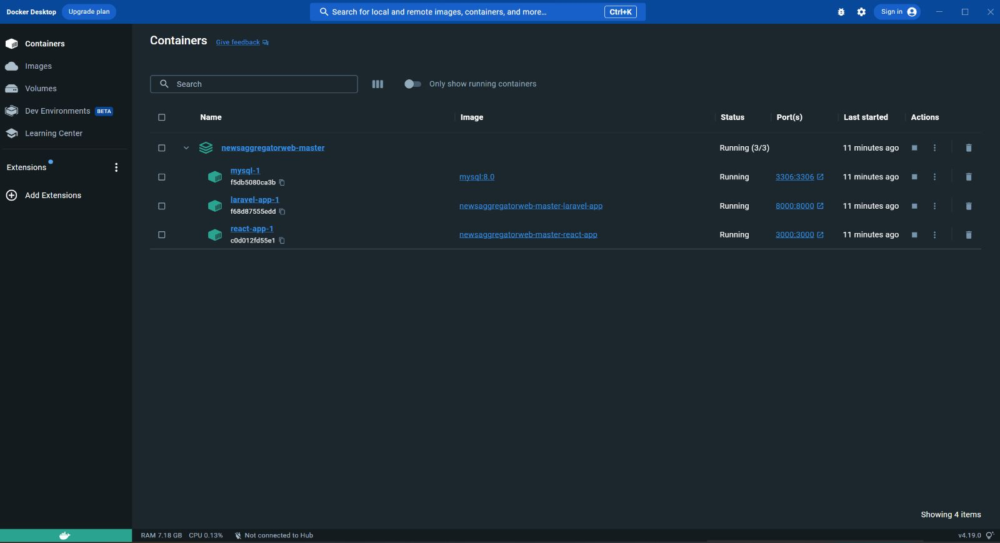

# Step1: Register yourself to get an API key for three different APIs.
# Step2: Create the Services folder to store all the services of our web application:

Newsapis: https://newsapi.org
The Guardian: https://open-platform.theguardian.com/
The New York Times: https://developer.nytimes.com/

- I put API keys for the testing purpose.

# Step3: Merge results of those three APIs and display them to Home page

# Step4: Added multiple search on Home page - Search By Authors, Sources, and Dates

# Step5: Create a preferences page where the user can save their preferences to see the news on the home page.

# Step6: Create user profile page

# Step to Run Project without docker
- GoTo the project folder 
- Open the command prompt and run the "npm install" command 
- Type "npm start" to run your project in the web browser
# Backend - Laravel implementation
- Go to the project folder and run the "composer install" command.
- "php artisan migrate"
- "php artisan serve" command to start the backend serve

# With Docker Container
- In both the frontend and backend folders, I configured all the settings to automatically install packages, migrate the database to a remote location, and serve the backend server on port 8080. 
- Open the root directory of your system where the frontend and backend folders are located. Run the docker-compose.yml up --build command to create the container. Please refer to the DockerContainers.jpg file to see all running containers on Docker.

  